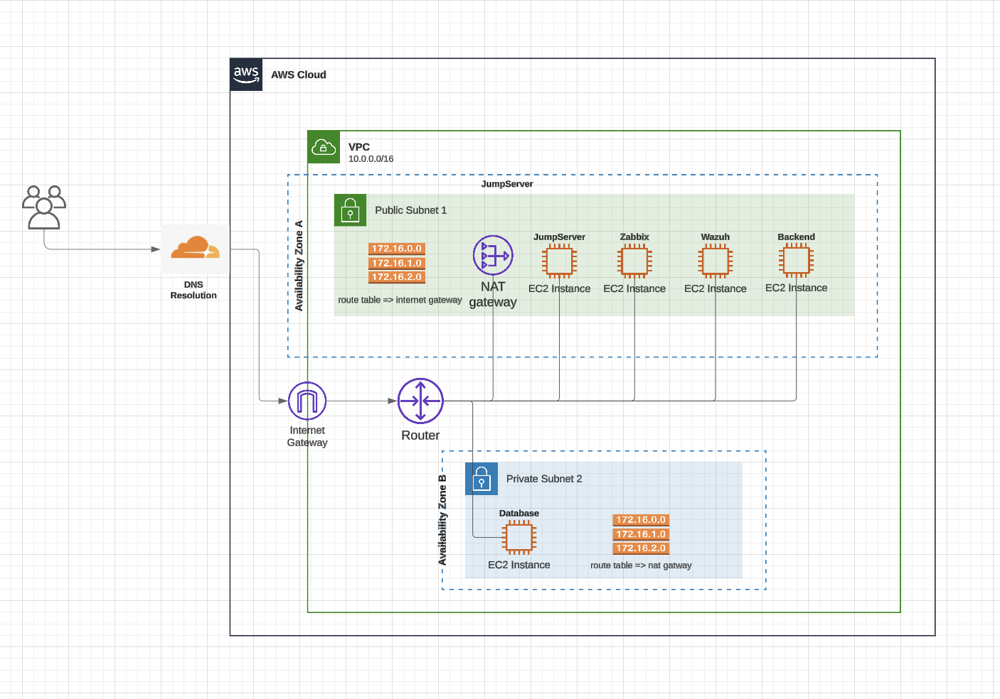

# AWS-Cloud-ARCHITECTURE

# Diagrama da Arquitetura




[Youtube Video](https://www.youtube.com/watch?v=BLX6GrUMj8c)


# Jump Server

## 🎯 Visão Geral
O Jump Server atua como ponto único e seguro de entrada para acessar as outras instâncias do ambiente (backend e database). Funciona como uma ponte de acesso que:
- Centraliza e protege o acesso às instâncias
- Previne conexões diretas aos servidores críticos
- Registra todas as tentativas de acesso
- Aumenta a segurança do ambiente
  
## 📋 Recursos Implementados

### 🔐 Autenticação de Dois Fatores (2FA)
Sistema de autenticação dupla implementado com Google Authenticator. Ao realizar a conexão SSH são solicitados:
- Código de verificação do Google Authenticator
- Senha do grupo de acesso

### 👥 Restrições de Acesso
Controle de acesso através de grupos específicos:
- jumpserver-admins: Acesso administrativo
- jumpserver-users: Acesso padrão

### 📝 Logs e Auditoria
Sistema de monitoramento completo com:
- Registros detalhados de autenticação
- Sistema de auditoria
- Rotação automática de logs

### 🛡️ Segurança Adicional
- Firewall configurado (UFW)
- Restrições SSH
- Monitoramento de tentativas de acesso

## 📊 Relatório de Evidências

O sistema gera automaticamente relatórios de evidências no arquivo `evidencias.txt`, contendo todos os detalhes de configuração e logs do sistema, incluindo:
- Status dos serviços
- Grupos e permissões configuradas
- Registros de acesso
- Configurações de segurança ativas

O relatório de evidências pode ser acessado através do seguinte comando dentro da máquina do jump server:

```bash
cat evidencias.txt
```

Caso não deseje entrar dentro da máquina, há uma cópia de um dos relatórios gerados nesse repositório. Basta abrir o arquivo com nome ```"evidencias_jump_server.txt"```.

> **Nota**: O relatório é atualizado automaticamente para refletir o estado atual do sistema.


## Monitoramento com Zabbix

## 🎯 Visão Geral
Solução de monitoramento centralizado que fornece visibilidade em tempo real da infraestrutura. Monitora métricas críticas dos servidores através de agentes instalados nas instâncias.

## 📋 Arquitetura
- Zabbix Server centralizado (instância pública)
- Agentes instalados nas instâncias:
 - Backend (público)
 - Database (privado)

## 🛡️ Segurança Implementada
### Regras de Firewall
- Comunicação restrita entre Zabbix Server e agentes
- Portas específicas para monitoramento (10050)
- Acesso controlado por IP de origem

## 📊 Monitoramento
### Métricas Coletadas
- Performance do sistema
- Utilização de recursos
- Estado dos serviços
- Logs do sistema

### Grupos de Monitoramento
- Linux Servers: Métricas base do sistema
- Databases: Métricas específicas de banco

## 🔄 Alta Disponibilidade
- Inicialização automática dos agentes
- Recuperação pós-reinicialização
- Persistência das configurações

> **Nota**: Sistema configurado para monitoramento passivo, onde o Zabbix Server inicia as conexões com os agentes.


## Monitoramento com Wazuh

### 🎯 Visão Geral
O Wazuh é integrado à infraestrutura para fornecer monitoramento de segurança, detecção de intrusões e auditoria detalhada. Em conjunto com a solução de monitoramento Zabbix, o Wazuh é utilizado para identificar atividades suspeitas e fornecer alertas em tempo real. A integração do Wazuh com o ambiente garantirá visibilidade e análise aprofundada de eventos de segurança, complementando a infraestrutura de monitoramento existente.

### 📋 Arquitetura de Integração
- **Wazuh Manager**: Instância centralizada que coleta e processa os logs de segurança.
- **Wazuh Agent**: Agentes instalados nas instâncias do Jump Server, Backend e Database, responsáveis por coletar e enviar logs para o Wazuh Manager.

### 🛡️ Segurança Implementada
#### Regras de Firewall
- Wazuh Manager (52.20.249.149) e Wazuh Agents (instâncias do Jump Server, Backend e Database) comunicam-se através da porta 1515.
- Comunicação segura e monitorada para garantir que apenas instâncias autorizadas possam enviar dados para o Wazuh Manager.

#### Monitoramento de Segurança
- **Logs de Segurança**: Todos os eventos relevantes de segurança (tentativas de login, alterações em arquivos críticos, acesso não autorizado) são monitorados e registrados.
- **Alertas de Intrusão**: O Wazuh detecta padrões de ataques conhecidos e gera alertas baseados em regras de segurança personalizáveis.
- **Auditoria Completa**: Todos os acessos e modificações realizadas nas instâncias são auditados e registrados no sistema, com possibilidade de visualização detalhada dos logs.

### 📊 Monitoramento de Eventos de Segurança
#### Métricas e Logs Coletados
- **Tentativas de acesso SSH**: Monitoramento e registro de todas as tentativas de login, incluindo informações sobre falhas e sucesso.
- **Modificações de Arquivos Críticos**: Monitoramento das alterações em arquivos de configuração, sistemas e logs do servidor.
- **Alertas de Intrusão**: Notificações em tempo real de atividades suspeitas, como tentativas de escalada de privilégios ou execução de comandos maliciosos.
- **Detecção de Malware**: O Wazuh executa a análise de logs em tempo real, gerando alertas para detectar qualquer comportamento anômalo ou código malicioso nos sistemas.

#### Grupos de Monitoramento
- **Servidores Linux**: Monitoramento das métricas do sistema, como desempenho, recursos e integridade do sistema.
- **Segurança de Banco de Dados**: Monitoramento de tentativas de acesso e alterações no banco de dados.

### 🔄 Alta Disponibilidade e Recuperação
- **Persistência e Recuperação**: O Wazuh Manager e os agentes estão configurados para garantir alta disponibilidade. Após falhas, os agentes retomam a coleta de logs automaticamente.
Configurações Persistentes: As configurações de segurança e monitoramento são mantidas durante reinicializações para garantir a continuidade da vigilância.
